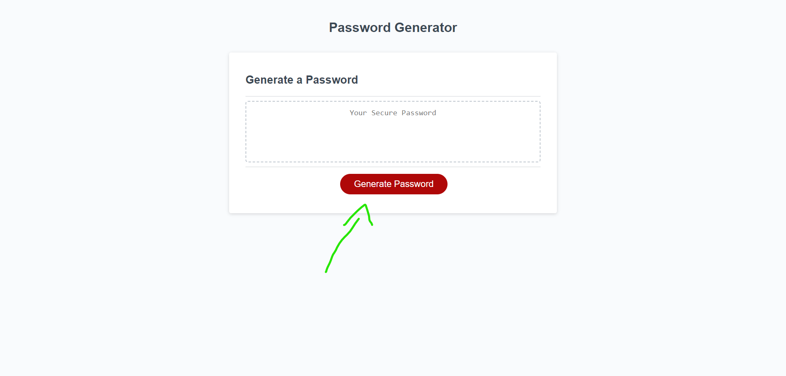
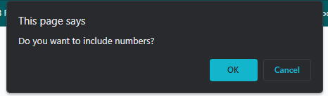
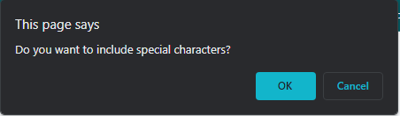
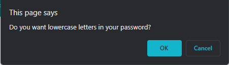
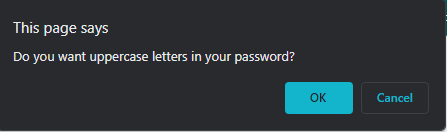
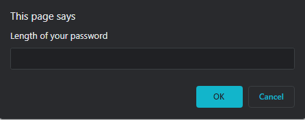
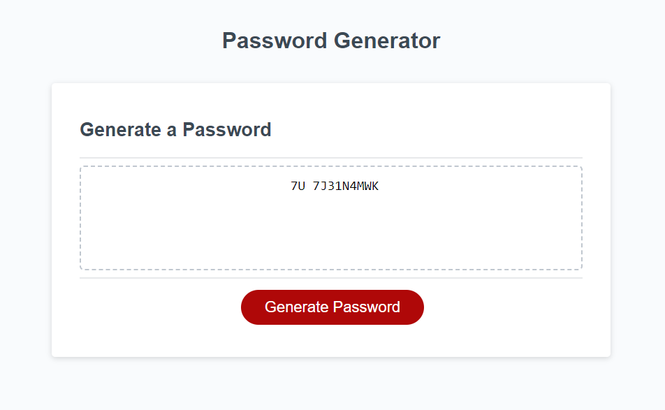

# challenge03

## Description
In this project, I was tasked to make a password generator program. Using my prolific js skills, I made the program able to generate random passwords.
It allowed me to gain pratice knowledge and some much needed confidence.  I

## Table of Contents (Optional)

If your README is long, add a table of contents to make it easy for users to find what they need.

- [Installation](#installation)
- [Usage](#usage)
- [Credits](#credits)
- [License](#license)

## Installation

N/A

## Usage

step 1: click on generate password.

step 2: asked if you want to include numbers in your password. For this example we selected ok.

step 3: asked if you want to include special characters in your password. For this example we selected no or cancel.

step 4: asked if you want to include lowercase characters in your password. For this example we selected no or cancel.

step 5: asked if you want to include uppercase characters in your password. For this example we selected yes or ok.

step 6: asked what is the lenght you want the password to be. 12 characters was selected for this example.

Step 7: Congrats, you got a randomly generated password!!

## Credits

I used this toturial to help me with my loop function since my first choice wasn't working properly
https://www.youtube.com/watch?v=Xrsb9SiF3a8

## License

---

## Badges

